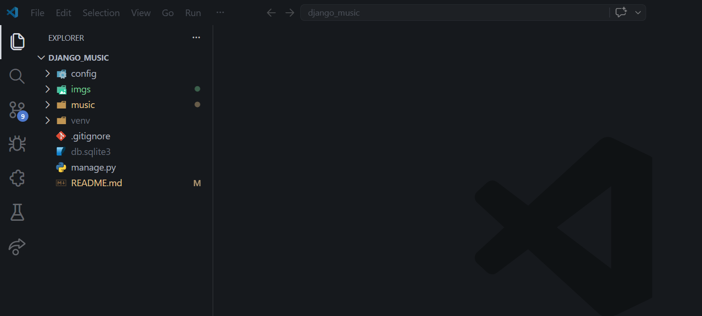
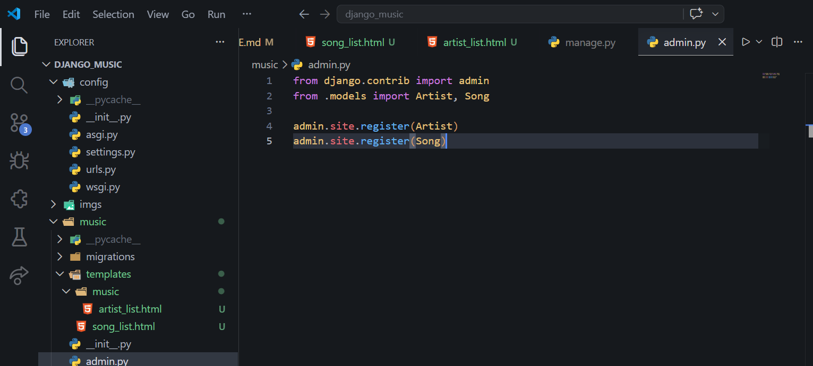
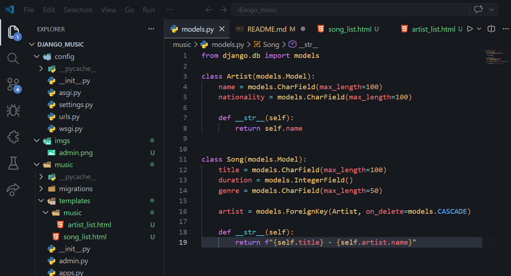
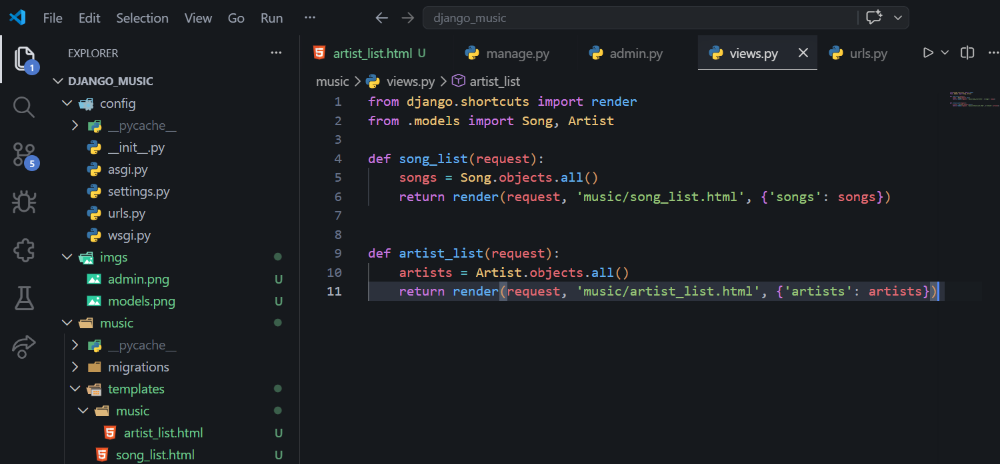
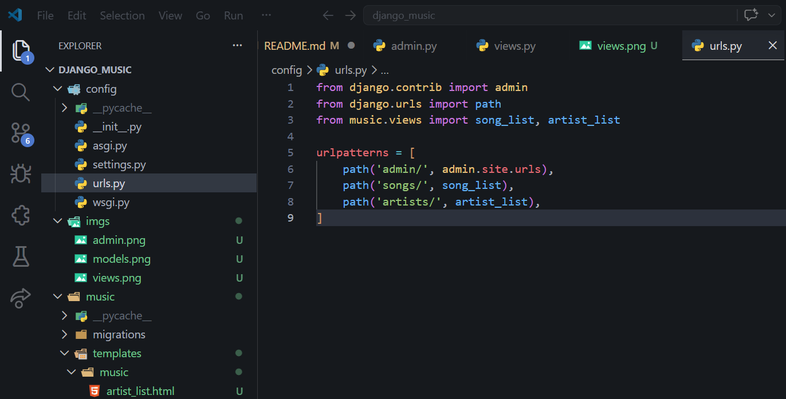
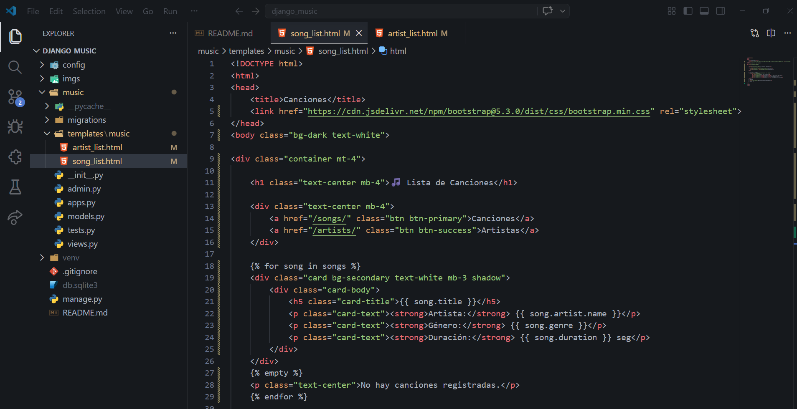
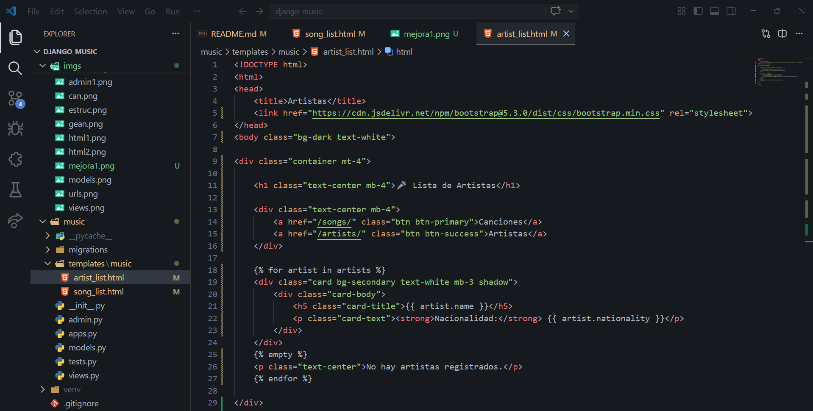
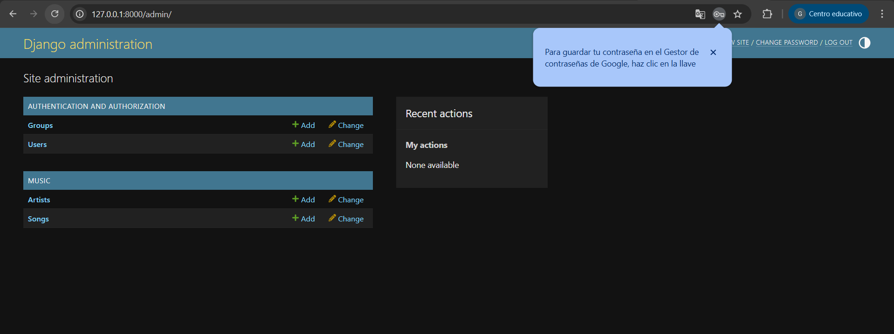
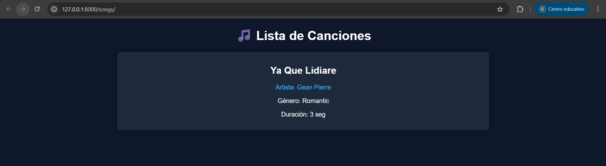
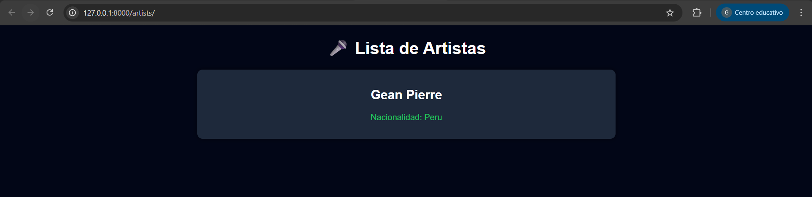

# 🎵 Django Music App

Aplicación web desarrollada en Django que permite gestionar canciones y artistas. 
Cada canción está asociada a un artista, permitiendo visualizar la relación entre ambas entidades.

## 🛠️ Tecnologías utilizadas

- **Python** → lenguaje principal del proyecto  
- **Django** → framework web para el desarrollo del sistema  
- **SQLite** → base de datos utilizada por defecto en Django  
- **HTML** → estructura de las páginas web   
- **Git & GitHub** → control de versiones y repositorio del proyecto  
- **Bootstrap** → estilos para mejorar la interfaz

## ⚙️ Funcionalidades

- Registro de artistas
- Registro de canciones
- Relación entre canciones y artistas
- Visualización de canciones
- Visualización de artistas

## 👨‍💻 Autor

Gean Pierre Ayala Andia

## 📸 Capturas

### Estructura del Proyecto

### Admin

### Models

### Views

### Urls

### Lista Artistas Html

### Lista Artistas Html

### Super Usuario (admin)

### Lista de Canciones

### Lista de Artistas

### Link Video en YouTube

### Parte Web
https://youtu.be/iRm-5QSLwAA?si=0ir6-YnhUbb0tsOv

### Parte De VsCode
https://youtu.be/wHLhtrpNBd8?si=Ml7A-KBs5dDjj4ZN
